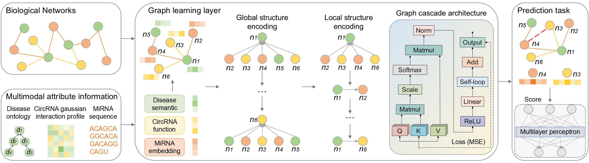

# Code for ZeroFusion
## Abstract
Motivation: CircRNA-miRNA interactions (CMIs) play a pivotal role in gene regulation and disease-related biological processes. However, accurate prediction of CMIs remains challenging due to the limited availability of experimentally validated interaction data. Existing computational methods often rely heavily on known CMIs under supervised settings, which restricts their applicability in realistic scenarios with scarce labeled interactions.
Results: We propose ZeroFusion, a zero-shot multimodal graph cascade learning framework for CMI prediction that integrates biological attribute features with graph structural representations. Specifically, disease ontology-driven semantics, circRNA functional similarities, and miRNA sequence embeddings are first constructed to characterize heterogeneous biological entities. To capture cross-entity dependencies, we design a cascaded architecture in which a graph Transformer models global long-range relational patterns, while a graph convolutional network refines fine-grained local neighborhood structures over circRNA-disease-miRNA associations. The resulting global and local structural representations are subsequently fused into unified embeddings and fed into a multilayer perceptron for CMI prediction. Experimental results demonstrate that ZeroFusion achieves an AUC of 0.9539 on the zero-shot dataset CMI-Zero and consistently outperforms state-of-the-art methods across benchmark datasets. In addition, case studies on hepatocellular carcinoma further validate the biological relevance and predictive robustness of the proposed framework.
## Framework

## Hardware requirements
Training the ZeroFusion model does not strictly require a GPU, but having one is highly desirable for efficient performance. Therefore, proper installation of GPU drivers, including CUDA integration, is recommended.
## Setup Environment
We recommend setting up the environment using [Anaconda](https://docs.anaconda.com/anaconda/install/index.html).
## Depedencies:
python>=3.9
numpy>=1.26.4  
pandas>=2.0.1  
transformers>=4.36.2  
torch>=2.0.1+cu117  
lightgbm>=3.3.5  
scipy>=1.10.0  
tqdm>=4.65.0  
matplotlib>=3.7.1  
## Usage Steps
1. **Positive and negative sample processing**: Generates biologically plausible negative samples and merges them with positive samples.  
   *Execution Script*: `generate_negative_samples_and_merge.py`
2. **Learning representations for biologically heterogeneous graphs**: A three-level cascaded architecture of graph Transformer, GCN, and nonlinear layers to capture global dependencies and local topology.  
   *Execution Script*: `graph_cascade_learning.py`
3. **Zero-Shot CMIs Prediction**: Five-fold cross-validation for indirect inference of circRNA-miRNA interaction prediction.  
   *Execution Script*: `prediction.py`
## Dislaimer
This code was developed for research purposes only. The authors make no warranties, express or implied, regarding its suitability for any particular purpose or its performance.
## License
This library is MIT licensed.

